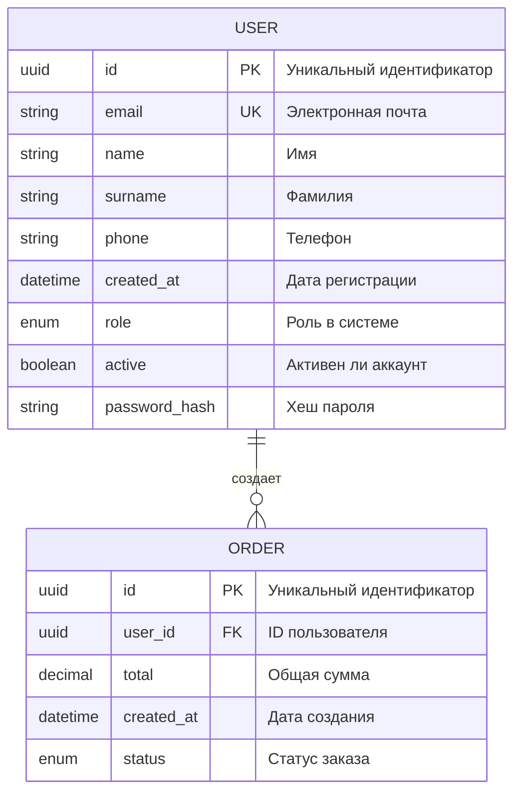

# ER-диаграмма: Модель данных

**Дата создания:** 2024-11-08
**Описание:** Диаграмма связей сущностей проекта

Эта диаграмма показывает все сущности системы и связи между ними.

---

## Диаграмма

---

## Легенда

### Типы связей:
- `||--o{` - Один ко многим (один пользователь может иметь много заказов)
- `||--||` - Один к одному
- `}o--o{` - Многие ко многим

### Обозначения полей:
- **PK** - Primary Key (первичный ключ)
- **FK** - Foreign Key (внешний ключ)
- **UK** - Unique Key (уникальное значение)

---

## Сущности в диаграмме

- **[ENT-001: Пользователь](../../entities/ENT-001-example.md)** - пользователь системы
- **ORDER** - заказ (пример для демонстрации связей)

---

## Бизнес-правила

1. Один пользователь может создать много заказов
2. Каждый заказ принадлежит только одному пользователю
3. Email пользователя должен быть уникальным
4. Все связи обязательны (не nullable)

---

## Использование

Эта диаграмма автоматически рендерится в:
- GitHub (в preview)
- Claude Code
- Многих редакторах Markdown

Можно скопировать в документацию, ТЗ, презентации.
