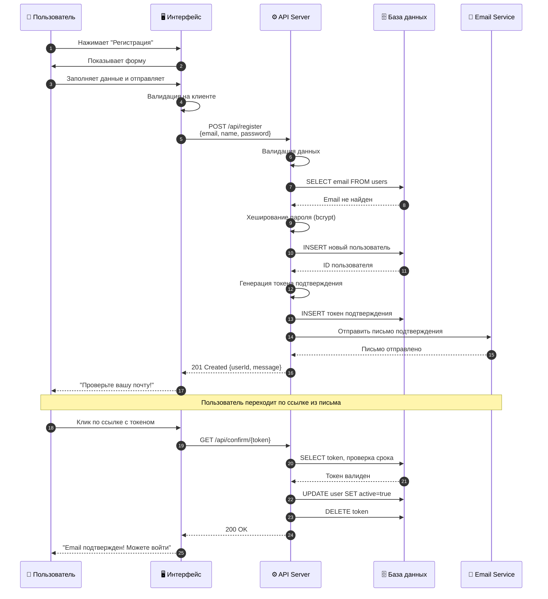
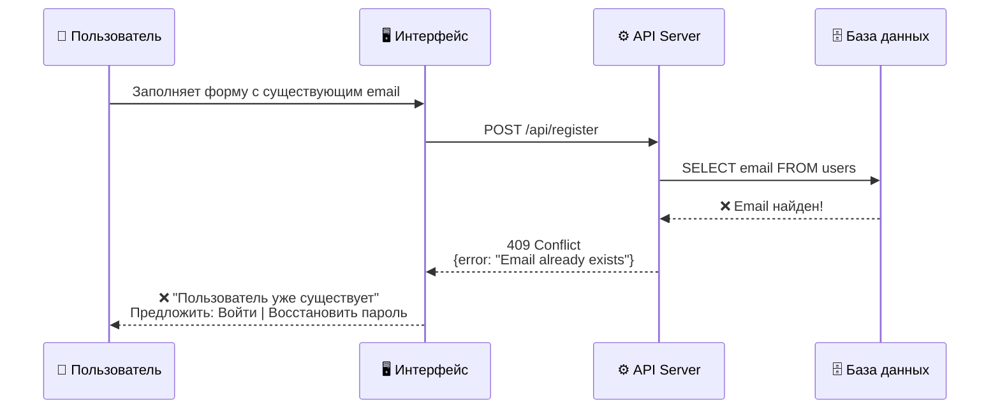
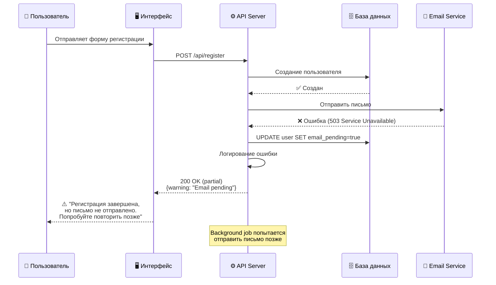

# Диаграмма последовательности: UC-001 Регистрация пользователя

**Дата создания:** 2024-11-08
**Описание:** Детальный флоу регистрации пользователя

Эта диаграмма показывает последовательность взаимодействий при регистрации.

---

## Основной сценарий (Happy Path)

---

## Альтернативный сценарий: Email уже существует

---

## Исключительная ситуация: Ошибка email сервиса

---

## Ключевые моменты

### Безопасность:
1. Пароль хешируется на сервере (bcrypt)
2. Токен подтверждения криптографически безопасен
3. Токен имеет срок действия (24 часа)

### Надежность:
1. Транзакционность операций с БД
2. Обработка ошибок email-сервиса
3. Валидация на клиенте и сервере

### Производительность:
1. Хеширование пароля асинхронно
2. Отправка email в фоновом режиме (опционально)

---

## Связанные документы

- **[UC-001: Регистрация пользователя](../../use-cases/UC-001-example.md)** - полное описание юз кейса
- **[REQ-F-001: Регистрация через email](../../requirements/functional/REQ-F-001-example.md)** - функциональное требование
- **[REQ-NF-001: Безопасность паролей](../../requirements/non-functional/REQ-NF-001-example.md)** - требование безопасности
