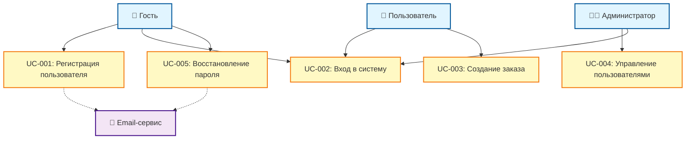

# Use Case диаграмма: Акторы и сценарии

**Дата создания:** 2024-11-08
**Описание:** Диаграмма юз кейсов и акторов системы

Эта диаграмма показывает кто (акторы) может делать что (юз кейсы) в системе.

---

## Диаграмма

---

## Легенда

### Обозначения:
- **Сплошная линия** → актор инициирует юз кейс
- **Пунктирная линия** -.-> юз кейс использует внешнюю систему
- **Цвета:**
  - 🔵 Голубой - акторы (пользователи системы)
  - 🟡 Желтый - юз кейсы (функции системы)
  - 🟣 Фиолетовый - внешние системы

---

## Описание акторов

| Актор | Описание | Юз кейсы |
|-------|----------|----------|
| 👥 Гость | Незарегистрированный пользователь | UC-001, UC-002, UC-005 |
| 👤 Пользователь | Зарегистрированный пользователь | UC-002, UC-003 |
| 👨‍💼 Администратор | Администратор системы | UC-002, UC-004 |
| 📧 Email-сервис | Внешний сервис для отправки email | - |

---

## Юз кейсы

- **[UC-001: Регистрация пользователя](../../use-cases/UC-001-example.md)** - создание нового аккаунта
- **[UC-002: Вход в систему](../../use-cases/UC-002-example.md)** - аутентификация пользователя
- **UC-003: Создание заказа** - оформление заказа (пример)
- **UC-004: Управление пользователями** - администрирование (пример)
- **UC-005: Восстановление пароля** - сброс пароля (пример)

---

## Использование

Используйте эту диаграмму для:
- Презентации функциональности системы
- Определения прав доступа
- Планирования разработки по приоритетам акторов
- Документации для новых членов команды
